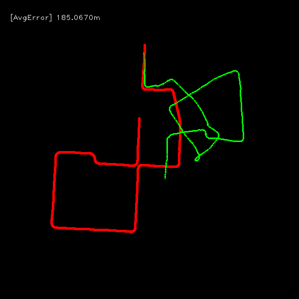
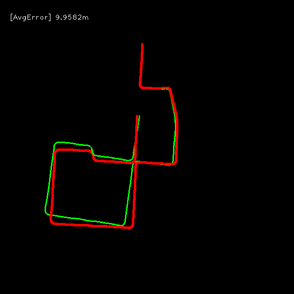
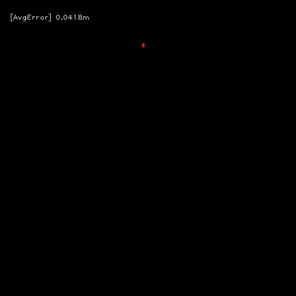

## Python-VO
A simple Python implementation of frame-by-frame visual odometry. This project is inspired and based on [superpoint-vo](https://github.com/syinari0123/SuperPoint-VO) and [monoVO-python](https://github.com/uoip/monoVO-python).

This repo supports classic features (ORB, SIFT) and learning-based features such as [SuperPoint](https://github.com/magicleap/SuperPointPretrainedNetwork), [XFeat](https://github.com/verlab/accelerated_features), and [SwiftFeat](https://github.com/rpautrat/SwiftFeat).
For feature matchers, we include OpenCV KNN/FLANN, and learning-based matchers like [SuperGlue](https://github.com/magicleap/SuperGluePretrainedNetwork) and [LightGlue](https://github.com/cvg/LightGlue).

**Feature detectors**
- ORB (OpenCV implementation)
- SIFT (OpenCV implementation)
- [SuperPoint](https://github.com/magicleap/SuperPointPretrainedNetwork) 
- [XFeat](https://github.com/verlab/accelerated_features)
- [SwiftFeat](https://github.com/rpautrat/SwiftFeat)

**Feature matchers**
- KNN, FLANN (OpenCV implementation)
- [SuperGlue](https://github.com/magicleap/SuperGluePretrainedNetwork)
- [LightGlue](https://github.com/cvg/LightGlue)
- XFeat matcher, XFeat* matcher
- SwiftFeat matcher, SwiftFeat* matcher

**SIFT Keypoints**


**SuperPoint Keypoints**


**SIFT+FLANN Matches**


**SuperPoint+FLANN Matches**


**SuperPoint+SuperGlue Matches**


## Install

- Get this repository
    ```bash
    git clone https://github.com/Shiaoming/Python-VO.git
    cd Python-VO
    ``` 
  
- Install python packages
    ```bash
    pip install -r requirements.txt
    ```

## Datasets
- **KITTI Odometry** via `KITTILoader` (`dataset.name: KITTILoader`), using `root_path` and `sequence`.
- **TUM RGB-D** via `TUMRGBLoader` (`dataset.name: TUMRGBLoader`), using `root_path` and `scene`.
- **Image sequence** via `SequenceImageLoader` (`dataset.name: SequenceImageLoader`), using `root_path` and `format` (e.g. `jpg`).

Example configs live in `config/` (e.g. `config/kitti_*.yaml`, `config/tumrgb_*.yaml`).

## Run
1. edit dataset path in `config/*.yaml`;
2. run `python main.py --config config/*.yaml` in terminal.
    
For example, to evaluate the SuperPoint with SuperGlue, run:

```bash
python main.py --config config/kitti_superpoint_supergluematch.yaml
```

To run multiple KITTI configs with a chosen sequence, use the helper script:

```bash
./run_kitti.sh --sequence 00 --configs config/kitti_xfeat_lightgluematch.yaml,config/kitti_swiftfeat_swiftfeatmatch.yaml
```

## Evaluations
**Absolute and relative translation errors on KITTI sequence 00**


**Average relative translation errors on KITTI sequence 00**

| orb_brutematch |     sift_flannmatch | superpoint_flannmatch | superpoint_supergluematch |
| :------------: | :-------------------: | :-------------------: | :-----------------------: |
|     0.748m     |        0.085m         |        0.177m         |          0.103m           |

**Trajectory of ORB feature with brute matcher on KITTI sequence 00**


- red: ground truth
- green: estimated trajectory

**Trajectory of SIFT feature with FLANN matcher on KITTI sequence 00**


- red: ground truth
- green: estimated trajectory

**Trajectory of SuperPoint feature with FLANN matcher on KITTI sequence 00**


- red: ground truth
- green: estimated trajectory

**Trajectory of SuperPoint feature with SuperGlue matcher on KITTI sequence 00**


- red: ground truth
- green: estimated trajectory
